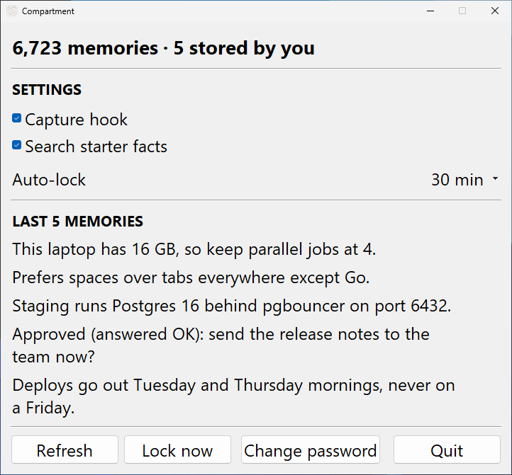

# Compartment

**Encrypted, fully offline memory for AI agents.** One vault on your own
computer, read and written by Claude Code, Claude Desktop, Hermes Agent,
OpenClaw, Cursor, Codex and any other MCP client. No API key, no account, no
network, no telemetry.

[](https://pypi.org/project/compartment/)
[](https://pepy.tech/project/compartment)
[](https://github.com/MaxFreedomPollard/Compartment/actions/workflows/ci.yml)
[](LICENSE)

<p align="center">
  
</p>

Compartment is durable memory for AI agents, kept on your own computer. A
decision made in one session is recalled in the next, in a different
project, from a different agent, and nothing leaves the machine to make that
happen.

Every memory is one claim, stamped with how it was established and the day
it became known. A memory can be given a last day and clears itself when
that day has passed. A changed preference replaces the old one instead of
accumulating beside it. Recall is a hybrid vector and keyword search over an
index held in RAM, answering in about 12 ms with what is relevant rather
than a fixed number of results.

The embedding model ships inside the package, and every byte at rest is
authenticated-encrypted, the embedding vectors included, under a passphrase
only you hold. The vault arrives with about 6,700 curated starting facts
about hardware, operating systems, ports, encodings and shell internals, so
an agent has a map of the computer-verse from its first session; they are
ordinary memories, and one switch keeps them out of search.

## Install

| | |
|---|---|
| **pip** (macOS, Linux, Windows) | `pip install compartment && compartment init` |
| **pipx / uv** | `pipx install compartment` or `uv tool install compartment`, then `compartment init` |
| **One click** (macOS) | open **Compartment.pkg** from the [latest release](https://github.com/MaxFreedomPollard/Compartment/releases/latest). Python, the embedding model and every dependency are inside it |
| **Claude Code plugin** | after `pip install compartment && compartment init`: `/plugin marketplace add MaxFreedomPollard/Compartment`, then `/plugin install compartment@maxfreedompollard`. Codex reads the same marketplace file |
| **Docker** | `docker build -t compartment .` from a checkout; see [Wiring each agent](#wiring-each-agent) |

The pip route needs Python 3.11 or newer. The app runs on macOS 13+, on
Windows (with the Microsoft Visual C++ runtime installed), and on any Linux
desktop.

`init` asks you for a passphrase (nothing is generated for you), creates the
vault, seeds the starting facts, connects Claude Code, Hermes Agent or
OpenClaw if it finds them, and starts the app: a menu bar item on macOS, a
tray icon on Windows, a window on Linux. Restart your agent and it has a
memory.

To connect an agent later, or any of the other clients:

```bash
compartment integrate claude      # Claude Code + Claude Desktop
compartment integrate hermes      # Hermes Agent
compartment integrate openclaw    # OpenClaw
compartment integrate --list      # the 28 MCP clients it can wire: Cursor, VS Code, Cline, Roo Code, Zed, OpenCode, Codex CLI, Gemini CLI, Oh My Pi, LM Studio, AnythingLLM, BoltAI ...
compartment integrate --all       # every one of them that is installed here
```

`claude`, `hermes` and `openclaw` also get the **`/compartmentalize`** skill
installed into their own skills directories. Any other MCP client takes this
block, stdio transport, no environment variables:

```json
{ "mcpServers": { "compartment": { "command": "compartment", "args": ["serve"] } } }
```

## How it compares with other memory servers

Where the memory lives and what protects it, as each project documents it,
checked 2 September 2026. Sources and the full table are in
[docs/COMPARISON.md](docs/COMPARISON.md); corrections are welcome as a PR
against that file.

| | Memory at rest | Encrypted | Account / API key | Network at runtime |
|---|---|---|---|---|
| **Compartment** | one sealed vault file, index in RAM | **yes, vectors too** | none | none, CI-enforced |
| `@modelcontextprotocol/server-memory` | plaintext `memory.jsonl`, substring search | no | none | none |
| mem0 (open source) | vector store + LLM-extracted facts; its MCP server is hosted only | not documented | LLM key | LLM calls; telemetry on by default |
| Graphiti (Zep) / Letta | Neo4j / server + database | not documented | LLM key | LLM calls; telemetry on by default |
| claude-mem | local SQLite + Chroma | not documented | sign-in required | account + provider calls; telemetry on by default |
| basic-memory (AGPL) | Markdown + SQLite | not documented | none | telemetry on by default |

## The memory logic

The full write path is in [docs/MEMORY.md](docs/MEMORY.md). The load-bearing
ideas:

**Nearly everything is stored; nothing important is buried.** Only empty
turns are dropped. A bare "OK" is not noise, it is a decision: when the agent
asks *"Want me to send this reply to the client now?"* and the user answers
*"OK"*, Compartment resolves the question from the conversation and stores
the decision together with what was decided. Small talk is kept and ranked
last.

**Deterministic importance tiers rank recall.** Decisions and consent 0.90,
personal facts and preferences 0.80, the user's machine and configuration
0.75, other substantive statements 0.55, pleasantries 0.20. A fixed rule,
not a model's mood. Importance multiplies a match rather than adding to it,
so it settles near-ties in favour of what matters and can never surface a
memory for a question it has nothing to do with. The agent learns the user
and the computer first, the world second.

**One claim per memory, enforced.** A memory is an atomized data point, not
a session log, and the store refuses anything else: over 200 characters (the
`max_memory_chars` setting), lists, headings, paragraphs, and "recorded in
the guide"-style narration all bounce with an error that says how to split.
Asking nicely was measured not to work: against a real vault the median
agent-written memory was 1,938 characters of headed, bulleted session log,
so the shape rule lives in code, where it is obeyed at the moment of the
mistake. `memory_store_many` takes a whole batch in one call, so six facts
cost the same round trip as one blob. `compartment atomize` retrofits an
existing vault: it lists the over-limit records for your agent to split and
applies the plan, every piece keeping the blob's own dates, the blob
superseded but readable by id.

**Every memory says where it came from and when.** `source` is required: "from
chat", "read from pyproject.toml", "web search". A memory that cannot say
where it came from is a claim with no way to check it. `discovered` is the
day the fact became known, separate from the moment it was saved: a price
you check on the Friday and write up on the Monday keeps Friday as its
discovery and Monday as its save. Both are appended to the text as a short
`[web search, 2026-08-01]` clause so they travel with it.

**A memory can have a last day.** A sale, a quoted rate, a booking, a rota,
a door code that changes on Monday: `expires` takes the day itself
(`2026-09-03`) or how long the fact lasts (`14d`, `2w`, `3m`, `1y`), the last
day counting. Expired memories clear themselves (`compartment expire` runs
it by hand; `expire_memories` turns it off). Most facts do not expire, and a
wrong expiry deletes a memory the user wanted, so a fact that merely might
change is an ordinary memory.

**Facts accumulate; opinions update.** The two kinds of claim age
differently. A fact, once established, joins the pile: the office door code
changed, a script lives at a path, a release shipped, each sits beside the
others without displacing any. An opinion does not work that way. When
someone states a preference, the right first question is never "where do I
put this?" but "**what does this replace?**". A vault that files opinions
the way it files facts fills with contradictions, and yesterday's replaced
preference keeps answering searches forever. So `kind="opinion"` stores
update-first: the vault looks for the live opinion the new one revises, and
if one resembles it the old record comes back instead of an insert, and the
caller resends with `supersedes=[old id]` to replace it (a merged text keeps
parts of both) or `supersedes=[]` to deliberately hold both. Restating a
live opinion refreshes its date instead of storing a twin. Superseded
records tombstone rather than delete: out of search and recent, kept in the
journal and audit chain, readable by id with a pointer to their replacement.
`supersedes` works on facts too, for corrections. Opinion ranking weights
recency far harder than fact ranking, so the current stance outranks a stale
one even before anything is reconciled; `compartment opinions audit` finds
overlapping live opinions stored before the kind existed and resolves them
keep-newest, or reports them for a subtler merge.

**Capture that does not depend on the model.** Instructions are a request,
and a host that declares its own memory in its system prompt outranks
anything a tool says. So the `PostToolUse` hook that `integrate claude`
installs writes the fact into the vault whether or not the model ever
thought about Compartment. The hook is additive and idempotent (your other
hooks are untouched, `settings.json` is backed up first), it exits
successfully no matter what, because a memory tool must never break your
editor, and it stays quiet when the vault is locked.
`compartment hook status | install | uninstall`, or
`integrate claude --no-hooks`; `compartment import-claude` sweeps up anything
the hook missed.

**Search returns what is relevant, not a fixed number.** How many memories
answer a question is a property of the question, so Compartment returns
every memory whose evidence stands up against the best answer to that same
question, capped generously. The cut has to be relative, because scores are
not comparable between questions: on a real vault the nonsense query "how to
bake sourdough bread" scored higher than the genuine "what did Max decide
about Airtable". Ask it something the vault knows nothing about and it
returns nothing at all rather than a page of polite irrelevancies. Pass an
explicit `top_k` when you want exactly that many.

**Tags that stay true.** What a memory is about never changes. What it is
relevant to changes constantly, and a tag written once, on the day the
memory was stored, cannot know that. Working on a project called Northwind,
you learn that your client wants figures before conclusions. The agent
stores it and tags it `northwind`, `reporting`, because Northwind is what was
in front of it that day. Two years later the same client, now going by the
name Harbour, hires you again. Your agent narrows recall to `harbour`, the
way anyone narrows a search once a vault holds thousands of memories, and
the one thing you most want applied is filed under a name that no longer
exists. The memory did not decay; its index entry did. Compartment repairs
that automatically, offline, in the background, without an LLM: as Harbour
memories accumulate they land beside that old preference in embedding
space, because they are about the same subject, and a background pass gives
every memory the tags its nearest neighbours carry, weighted by cosine. Two
more signals run alongside it: tags that nearly always occur together come
to imply one another, and any existing tag whose phrase appears in a
memory's own text is attached. The pass can only write the tags column,
never the text, the dates or the embeddings. It is additive unless you pass
`--prune`, `tags_origin` keeps the tags a memory was born with forever, and
`compartment retag --dry-run` shows exactly what would change.

**A graph, not a pile.** `memory_link` records explicit relations, subject,
predicate, object, optionally tied to the memory they came from and to a
validity window; `memory_relations` answers by entity, by predicate, or as
of a date. Storage and matching are deterministic; the judgment of what to
link belongs to the host model, exactly like curation.

**Data, not instructions.** Memories recalled from storage are wrapped with a
notice that they are stored data, not directives. Content stored from an
untrusted source can be flagged `quarantined`, which attaches an explicit
warning envelope to every future recall. This is a mitigation, not a
guarantee; the host agent must still treat memory as data.

**One pinned embedding space.** The model's SHA-256 is recorded in the vault
and enforced at open, so cosine comparisons stay mathematically valid
forever instead of silently degrading when a model changes. Migration is
explicit: `compartment reindex --re-embed`.

**No LLM inside.** Embeddings run locally (bundled 384-dim int8 ONNX model,
under 300 MB of RAM). Judgment belongs to the host model you already run,
via `memory_store` / `memory_forget`; Compartment contributes deterministic
capture, encryption, and total recall. That split is what makes the offline
guarantee absolute and every decision reproducible. Pair Compartment with an
offline LLM and the whole agent stack can run usefully with no network at
all.

**See what it just learned.** `compartment recent` lists the newest memories,
newest last, hiding the thousands of seeded starting facts so the handful
that real use produced are actually visible, and `compartment status`
reports `organic_records` beside the total, so a vault that has learned
nothing can never look busy. Same view over MCP as `memory_recent`.

## The mathematics

Everything below lives in one file,
[`src/compartment/ranking.py`](src/compartment/ranking.py), which the vault,
the dashboard and the benchmark all import. A benchmark score is therefore a
measurement of the product and not of a copy of it that has drifted.

### Storage: a memory is embedded in windows, not truncated

The encoder reads 512 tokens. Text past that is not weighted less, it is not
seen at all, so a long memory used to be searchable only by its opening. On
a real 6,705-memory vault, 40% of records ran past the window and **57.6% of
the whole corpus was invisible to semantic search**.

So a record is embedded as overlapping windows of `W = 448` tokens at a
stride of `S = 384`, giving 64 tokens of overlap so no fact is cut in half
by a boundary, and the record is scored by its best window:

```
windows(d) = ceil( max(0, tokens(d) - W) / S ) + 1        capped at 64

s_vec(d)   = max over windows w of d :  cos(q, w)
```

Max-pooling, not averaging: a memory is relevant if **any** part of it is,
and an average would punish a long memory for the parts that are about
something else. With one window per record it reduces exactly to the old
behaviour, so it can never be worse for a short memory. The cost is small
because most memories are short: on that vault, 6,705 records produced 6,785
windows. Windows are measured in model tokens, never characters; a character
budget is wrong by a factor of three between prose and a hex digest.

### Recall: two channels, combined as evidence rather than added

Two indexes look for a memory and they answer different questions. The
vector index answers *what does this mean*. The keyword index answers *what
does this say*. Their scores are not denominated in the same thing, and
combining them is the entire difficulty.

The obvious move, and what Compartment shipped until 4.7, is to add them.
Adding is the wrong operation: it lets a merely-good semantic match outvote
conclusive literal evidence. Searching a real vault for a commit sha
occurring in exactly one memory out of 6,705 returned that memory **below
ten paraphrases of it**; the keyword index had ranked it first and the sum
buried it.

The two channels are not addends, they are **alternatives**: either one
alone can establish relevance. That is a soft OR over independent evidence,

```
P(relevant) = 1 - (1 - p_vec)(1 - p_lex)
```

and the score is its logarithm, which ranks identically while continuing to
spread results apart near the top instead of saturating at 1:

```
score(d) = - w_vec · log(1 - p_vec(d))  -  w_lex · log(1 - p_lex(d))

w_vec = 0.75      w_lex = 0.25
```

Either channel approaching certainty carries the memory on its own, and
neither can veto the other.

**Reading a cosine as a probability.** An L2-normalized encoder gives
cosines that are comparable *across* queries, so they map through fixed
bounds. Per-query min-max normalization is the obvious alternative and it is
a trap: it rescales the best hit of a hopeless query up to 1.0 and throws
that calibration away.

```
p_vec(d) = clamp( (cos(q, d) - 0.25) / (0.85 - 0.25),  0,  0.88 )
```

That ceiling of 0.88 is doing real work. A cosine is a similarity, never an
identity: an encoder can say *this is about the same thing*, but it can never
say *this is the record you named*. A literal match on a string unique to
one memory can say exactly that. So the semantic channel is capped below the
certainty the literal channel may reach, and the bound is forced rather than
chosen: the literal channel tops out at `0.25 · -log(1 - 0.999) = 1.727`, so
the cap must satisfy `0.75 · -log(1 - cap) < 1.727`, giving `cap < 0.90`.

**Reading a keyword hit as a probability, and deliberately not with BM25.**
BM25 answers *how well does this match*, which is not what settles a contest
against a semantic hit. What settles it is how unlikely the match was by
chance. So each query term carries its self-information over the vault, and
a memory scores the **fraction of the query's information it accounts for**:

```
I(t)     = log( N / (1 + df(t)) )                     N = records in the vault

p_lex(d) = ( Σ I(t) for query terms t present in d ) / ( Σ I(t) for all t )
```

A term unique to one memory is near-conclusive evidence. A term appearing in
a tenth of the vault is nearly none, whatever its BM25 happens to be. This is
the piece that makes a literal hit and a semantic hit comparable at all.

The keyword index is queried as AND first, since an exact phrase match is
the strongest signal available. FTS5's implicit AND means a nine-word
question has to appear word for word, so when AND finds nothing it falls
back to OR over only the terms carrying information; anything appearing in
more than 10% of records is dropped. That ceiling is measured from the vault
rather than taken from an English stopword list, so it behaves the same for
a vault full of code, of names, or of another language.

A small rank-agreement residue is added, the one thing reciprocal-rank
fusion is genuinely good at, sized to break ties rather than decide them:

```
+ w_rrf · k · [ 1/(k + rank_vec) + 1/(k + rank_lex) ]      w_rrf = 0.10, k = 20
```

### Importance ranking: priors multiply, they never add

```
final(d) = score(d) · ( 1 + w_imp · (2·importance(d) - 1)
                          + w_rec · 2^( -age_days(d) / half_life ) )

facts:     w_imp = 0.15   w_rec = 0.10   half_life = 180 days, from `created`
opinions:  w_imp = 0.15   w_rec = 0.30   half_life = 30 days,  from the last
                                         re-affirmation (`affirmed`)
```

**Multiplicative, so a prior can only reorder a memory that already
matched.** An additive prior lets a very important memory surface for a
question it has nothing to do with, which is how a memory system starts
feeling haunted. A memory that matched nothing scores zero, and nothing can
lift it off zero.

**Centred on the 0.5 default**, which is why `2·importance - 1` appears
rather than `importance`. Every unweighted memory carries 0.5, including the
thousands of starting facts a vault ships with. Uncentred, they all collect
the same silent boost, which is another way of saying importance did nothing
at all. Centred, an unweighted memory is exactly neutral and a deliberate
weight is the only thing that moves.

A fact's recency halves every 180 days from when it was stored; an opinion's
halves every 30 days from when it was last re-affirmed, at three times the
weight. A stance is only as good as its currency, and the newest one on a
subject must win.

### Retrieval order, and why the pool is wide

Namespace, tag, date and starter-fact filters run *after* ranking, so a
candidate pool sized to the number of results requested can be emptied by
them while matching memories sit just past the cut. The pool starts at 200
per channel and widens up to three times when filtering leaves too few.
Below 20,000 records the vector search is exact SIMD matrix math, recall 1.0
by construction; above it, SIMD HNSW at about 99% recall.

### Measured

Against the previous scorer, end to end through `Vault.search`, on a real
6,705-memory vault with 44 queries in four families:

| | before | after |
|---|---|---|
| Recall@1 | 0.523 | **0.773** |
| Recall@5 | 0.705 | **0.977** |
| MRR@10 | 0.601 | **0.845** |
| nDCG@10 | 0.627 | **0.878** |
| exact identifiers found in top 5 | 4/10 | **10/10** |
| facts past the encoder window | 0/6 | **5/6** |
| paraphrases | 16/16 | 16/16 |
| median search latency | 4.4 ms | 11.6 ms |

Nothing regressed in any family. The weights were chosen from a sensitivity
sweep and are deliberately round: the result is flat around them, because a
ranker that only works at `w_lex = 0.37` is a ranker that does not work.

## The app and the dashboard

<p align="center">
  
  &nbsp;&nbsp;&nbsp;
  
</p>

The same panel, in the place each system keeps things like this: the **menu
bar** on macOS, the **notification area** on Windows, and on **Linux** an
ordinary window, with Compartment in your applications menu. Linux gets a
window rather than an icon deliberately: whether a tray icon appears there
depends on the desktop, and on GNOME or Wayland it can simply never show up
with nothing said, which is the worst way for the control that unlocks your
memories to fail.

The panel shows whether the vault is open, how much it has learned and how
much of that you stored, the three settings worth changing day to day
(capture hook, whether starter facts join searches, auto-lock), which agents
are connected and buttons to connect Claude, Hermes Agent or OpenClaw, and
the last five things it remembered. Unlock, lock and change your passphrase
there too, without opening a terminal. It holds no vault in memory; state
comes from the CLI, so an idle app costs nothing. We design to be one of the
many hundreds of applications on your computer, not one you have to study:
every function is a button or a switch, and the defaults are the ones the
mathematics above chose.

`compartment panel --login on | off | status` controls starting at login,
which on Linux is the applications menu entry. `init --no-app` skips the app
for headless boxes and CI.

**`compartment dash`** opens the whole vault on a local page: how many
memories of what kind, growth over time, the relation graph, tags, per-agent
counts, live search. Served from RAM, 127.0.0.1 only, behind a random URL
token, read-only, zero outbound requests, zero configuration. Ctrl-C closes
it.

## Wiring each agent

Every one of these is also a button in the app, under **CONNECT AN AGENT**.
On Windows, run the same commands in PowerShell with
`py -m pip install compartment` in place of `pip install compartment`.

**Claude (Code + Desktop)**

```bash
pip install compartment && compartment init && compartment integrate claude
```

Registers the MCP server with the Claude Code CLI (user scope, all
projects), imports the memories Claude Code has already written to its own
memory files (copy-only and idempotent; `--no-import` skips it), installs
the capture hook (`--no-hooks` skips it), installs the `/compartmentalize`
skill, writes a managed block into `CLAUDE.md`, and prints the Claude
Desktop config block. The server describes itself over the MCP handshake,
telling the model to recall before answering and to store durable facts,
credentials, names and decisions, so Claude treats Compartment as its memory
with no hand-written instruction.

**Hermes Agent**

```bash
pip install compartment && compartment init && compartment integrate hermes
```

Installs the provider plugin, wires the Hermes venv, and runs
`hermes memory setup compartment`; verify with `hermes memory status`.
Hermes Agent also reads the portable [Agent Plugins](https://agent-plugins.org)
format, and this repository is one. That route installs the MCP server and
the `/compartmentalize` skill straight from GitHub, and wants Hermes Agent
0.20.0 or newer:

```bash
pip install compartment && compartment init
hermes plugins install MaxFreedomPollard/Compartment
hermes plugins enable compartment
```

The provider above remains the fuller integration, because recall and
persistence run automatically on every turn where the portable package is
tool-invoked. On macOS and Windows the two resolve to the same plugin
directory name, so install one or the other.

**OpenClaw**

```bash
pip install compartment && compartment init && compartment integrate openclaw
```

Writes the `mcpServers` entry into `~/.openclaw/openclaw.json` (with a
backup), then: `openclaw gateway restart` and confirm with
`openclaw mcp list`.

**Any MCP client**

`compartment integrate <client>` wires any of the twenty-eight clients in
`--list`. Each config write takes a byte-exact backup first, merges rather
than replaces, writes atomically, and refuses to touch a file it cannot
parse (printing the block for manual pasting instead). By hand, the block is
the one in [Install](#install): VS Code uses the key `servers` with
`"type": "stdio"`, Zed uses `context_servers`, Codex uses TOML under
`[mcp_servers.compartment]`. `--vault` and `--caller` are optional
(`compartment --vault PATH --caller NAME serve`); the defaults use
`~/.compartment/memory.vault` with caller `user`. Client-by-client
walkthroughs are in [docs/INTEGRATIONS.md](docs/INTEGRATIONS.md).

**Docker**

`docker build -t compartment .` from a checkout builds a headless image:
stdio only, no port and no `EXPOSE`, unprivileged user, the vault on a bind
mount at `/data`. Create the vault on the host first with `compartment init`,
because that step deliberately prompts for the passphrase rather than
accepting a machine-generated one.

## One vault, many agents, any machine

Claude, Hermes Agent, Cursor and the CLI can share a single vault
simultaneously: writes are serialized by an advisory file lock, every process
detects foreign writes and reloads, and each host gets its own caller
identity and namespace with rw / ro / none grants, so a scratch agent can
read the vault without writing to it.

A locked vault is one portable file, safe to move over any channel:

```bash
compartment lock --sign
scp ~/.compartment/memory.vault other-machine:
compartment --vault memory.vault unlock     # your passphrase (+ keyfile if 2FA)
```

`lock --sign` seals it with an Ed25519 manifest the recipient can verify
without any credential (`compartment verify`). `export --plaintext` writes
the vault out as JSONL and `import` reads it back, the escape hatch that
makes the format nobody's hostage; [FORMAT.md](FORMAT.md) specifies the
`.vault` and `.mpack` files byte by byte.

**Memory packs** are signed, read-only bundles of curated memories
(`compartment pack build | install | remove | list | export`). They install
under `packs/<name>`, immutable for every caller, so separately curated
content is never diluted by chat traffic; `include_packs_in_search` toggles
them. A pack's signature is checked against a key you trust, never against
the key the pack carries, so a pack cannot vouch for itself. The starting
facts are the one pack that lives in `main` as ordinary memories.
[PACKS.md](PACKS.md) covers authoring.

`compartment setup airgap-bundle` prepares an install for a machine that
will never see a network; `setup download-model` and
`setup download-longmemeval` fetch what the optional benchmarks need, on a
machine that can.

## Security and the lock model

The primitives: XChaCha20-Poly1305 AEAD on everything at rest, embedding
vectors included, because vectors can be inverted back toward their text ·
Argon2id keyslots, LUKS-style · per-record keys, so `forget --shred`
destroys the key and the content is mathematically unrecoverable rather than
marked deleted · fsync'd sealed journal, atomic compaction, verified kill-9
crash recovery · hash-chained tamper-evident audit log (`compartment audit
verify`) · signed vault manifests and packs · stdio transport, zero open
ports · a runtime offline guard that aborts on any socket attempt
(`--assert-offline`), with CI running the whole suite under it on Linux,
macOS and Windows. The full threat model, including what Compartment cannot
protect against, is in [SECURITY.md](SECURITY.md).

You lock and unlock the vault yourself, whenever you want.

- **`compartment unlock`** opens the vault with YOUR passphrase. You chose
  it; Compartment never auto-generates a password, seed, or recovery phrase,
  and there is no credential it knows that you don't. (Vaults made by older
  versions that received a recovery phrase still open with it.)
- **`compartment lock`** closes it again and clears every stored credential.
  Agents can do the same via the `memory_lock` panic tool.
- **`compartment 2fa enable`** adds a second factor: your passphrase
  (knowledge) plus a keyfile (possession; keep it on a USB stick). Both
  factors feed Argon2id together, so needing both is enforced by arithmetic,
  not a policy check; a stolen vault file plus your passphrase still opens
  nothing without the keyfile. The keyfile's location is remembered, so
  day-to-day unlocking feels exactly the same while the file is present.

The default unlock mode is convenience, not a cage: after a normal unlock the
vault stays usable across processes, logouts and logins, for weeks or months
if you leave it that way, until the next restart or power loss, until the
auto-lock timer fires (15, 30 or 60 idle minutes in the panel; `0` never),
or until you lock it yourself. Restart or power loss always locks it: the
stored credential is the master key wrapped under a random 32-byte per-boot
secret, held in a volatile kernel object that is never written to any
filesystem, so a restart destroys it and a new boot can never open the old
wrap. A copy of the credential file on its own is useless, because the key
it needs was never on the disk.

If you prefer reboot-surviving unlock on macOS, that is an explicit opt-in
(`compartment unlock --keychain`), with the tradeoff documented. The
`memory_unlock` MCP tool exists but is off by default, because turning it on
means the passphrase crosses the model's context.

## Measured, on an 8 GB baseline laptop

Every number below is reproducible on your machine with `compartment
selftest` and `compartment bench` (`--longmemeval` runs the retrieval
accuracy benchmark).

| Metric | Measured |
|---|---|
| Fresh install → open vault, offline | seconds, zero network |
| Vector search, 20k records (HNSW) | p95 0.68 ms |
| Full hybrid search (embed + windows + keywords + evidence fusion) | median 11.6 ms, p95 14.7 ms |
| Peak RSS, model + vault + index resident | 319 MB |
| Store one memory (embed + encrypt + fsync journal) | ~40 ms |
| Wheel size, model included | ~30 MB |
| Test suite (crypto, tamper, crash, offline, concurrency, 2FA, graph, dash, ranking) | 800+ tests, offline guard active |

## Configuration

Nothing here is required. Compartment installs configured, and this is the
whole surface if you want to change something.

### In the app

The panel behind the icon: **Unlock** and **Lock**, **Change password**,
**Create memories automatically** (the capture hook), **Search starter
facts**, **Auto-lock** (15, 30, 60 minutes or never), the **CONNECT AN
AGENT** buttons for Claude, Hermes Agent and OpenClaw, **Refresh** and
**Quit**.

### Commands

Global flags, before the command: `--vault PATH`, `--caller NAME`,
`--keyfile PATH`, `--assert-offline`, `--version`.

| Command | What it does |
|---|---|
| `init` | create the vault. `--passphrase`, `--creator`, `--keychain`, `--no-session`, `--no-app` |
| `unlock` / `lock` | open or close it. `--passphrase-stdin`, `--keyfile`, `--keychain`, `--once`; `lock --sign --identity` |
| `status` / `verify` / `selftest` | what is in it, is it intact, does it work |
| `store` / `get` / `forget` | one memory. `--source` (required), `--discovered`, `--expires`, `--namespace`, `--tag`, `--importance`, `--kind fact\|opinion`, `--supersedes ID`, `--keep-both`, `--quarantined`, `--raw`; `forget --shred` |
| `search` / `recent` | find things. `--namespace`, `--tag`, `--top-k`, `--limit`, `--all`, `--json` |
| `expire` | clear memories whose last day has passed |
| `atomize` | list over-limit blob memories as JSONL (`--out` + `--plaintext`), apply an agent-written split plan (`--apply`) |
| `opinions audit` | backfill `kind` on opinion-shaped records, cluster overlapping live opinions, resolve with `--keep-newest`. `--threshold`, `--no-backfill`, `--json` |
| `link` / `relations` / `unlink` | the relation graph, with validity windows (`--from`, `--to`, `--as-of`) |
| `panel` (`menubar`, `tray`) | the app. `--show`, `--self-check`, `--render`, `--login` |
| `integrate <agent>` | wire claude, hermes, openclaw or any listed client, and install `/compartmentalize`. `--list`, `--all`, `--no-import`, `--no-hooks` |
| `hook` | the Claude Code capture hook: `install --pin-vault`, `uninstall`, `status`, `capture` |
| `import-claude` | pull in what Claude Code already wrote. `--dir`, `--namespace`, `--dry-run` |
| `serve` | the MCP server, over stdio |
| `dash` | read the vault in a browser: 127.0.0.1, one-time token, GET only |
| `export` / `import` | `export --plaintext` writes it unencrypted; `import` reads it back |
| `rekey` | change the passphrase. `--new-passphrase-stdin` |
| `2fa` | `enable`, `disable`, `status`: a keyfile as a second factor |
| `audit` | `verify`, `repair` the hash-chained history |
| `retag` | re-derive tags from the vault as it stands now (`--dry-run`, `--prune`); never touches memory text |
| `reindex` | rebuild the index, and give long records the embedding windows they are missing. `--int8`, `--f32`, `--re-embed`, `--model` |
| `pack` | `build`, `install`, `remove`, `list`, `export` signed memory packs (`--trusted-key`) |
| `bench` | `--records`, `--longmemeval`, `--variant`, `--limit` |
| `setup` | `download-model`, `download-longmemeval`, `airgap-bundle` |
| `update` | upgrade in place. `--source` takes GitHub main, `--no-app` skips the restart |
| `uninstall` | remove it. The vault is kept unless you pass `--purge` |

### The /compartmentalize skill

`compartment integrate <agent>` writes one file into that agent's own skills
directory, and `compartment uninstall` takes it back:

| Agent | Path |
|---|---|
| Claude Code | `~/.claude/skills/compartmentalize/SKILL.md` |
| Hermes Agent | `$HERMES_HOME` or `~/.hermes/skills/compartmentalize/SKILL.md` |
| OpenClaw | `$OPENCLAW_HOME` or `~/.openclaw/skills/compartmentalize/SKILL.md` |

All three read the same Agent Skills layout, so it is one packaged file. It
is user-invoked only: no agent runs it on its own guess. Type it before
compacting, or at any point, and the agent sweeps the whole conversation
into the vault: people and contacts, credentials and where they live, URLs
and hosts, decisions and the reasoning behind them, and a record of the
session itself. Expect a burst of `memory_store` calls; that is the point.
Edit your copy freely: a later install backs up anything that differs rather
than overwriting it.

### Settings file

`<vault>.config.json`, beside the vault, holding grants per caller and:

| Setting | Default | Meaning |
|---|---|---|
| `auto_lock_minutes` | `30` | idle time before it locks. `0` never locks |
| `search_starter_facts` | `true` | whether the seeded facts join search results |
| `include_packs_in_search` | `true` | the same, for installed packs |
| `expire_memories` | `true` | clear memories whose last day has passed |
| `duplicate_threshold` | `0.97` | cosine similarity at which a store is a duplicate |
| `max_memory_chars` | `200` | the store gate's one-claim length limit for authored memories. `0` disables the length and layout checks |
| `opinion_update_threshold` | `0.80` | similarity at which a new opinion is an update of a live one and needs a supersedes decision |
| `opinion_reaffirm_threshold` | `0.97` | similarity at which a restated opinion re-affirms the live record instead of storing |
| `retag_interval_hours` | `6` | how often the background pass re-derives tags. `0` turns it off |
| `retag_prune` | `false` | whether that pass may also REMOVE tags the vault no longer supports |
| `index_precision` | `"f32"` | `"int8"` uses a quarter of the RAM |
| `unlock_tool_enabled` | `false` | lets an agent unlock the vault. Off because the passphrase would cross the model's context |

### Environment

`COMPARTMENT_VAULT` which vault to use, `COMPARTMENT_PASSPHRASE` for scripts
and CI, `COMPARTMENT_SESSION_DIR` where the unlock credential lives,
`COMPARTMENT_UI_SCALE` panel scale, `COMPARTMENT_ASSERT_OFFLINE` abort on any
network attempt. `HERMES_HOME`, `OPENCLAW_HOME` and `XDG_DATA_HOME` are read
where they apply. Anything exported as `ENGRAM_*` still works.

### MCP tools

Every tool carries a title and a read-only or destructive annotation, so a
client can tell the seven that only read from the ones that write before it
calls anything. `memory_search`, `memory_store`, `memory_store_many`,
`memory_get`, `memory_recent`, `memory_forget`, `memory_link`,
`memory_relations`, `memory_unlink`, `memory_list_namespaces`,
`memory_status`, `memory_lock`, `memory_selftest`. `memory_unlock` exists but
is off unless you turn it on above.

## Documentation

| | |
|---|---|
| [docs/MEMORY.md](docs/MEMORY.md) | how memory is stored, what gets remembered, why the math wins |
| [docs/INTEGRATIONS.md](docs/INTEGRATIONS.md) | selecting Compartment in Hermes Agent, OpenClaw, Claude, everything else |
| [docs/COMPARISON.md](docs/COMPARISON.md) | other memory servers, with sources |
| [SECURITY.md](SECURITY.md) | full threat model, honest limits |
| [FORMAT.md](FORMAT.md) | byte-level `.vault` and `.mpack` specs (language-agnostic) |
| [PACKS.md](PACKS.md) | authoring and shipping signed memory packs |
| [CONTRIBUTING.md](CONTRIBUTING.md) | setting up, what makes a good issue, keeping the guarantees |
| [RELEASING.md](RELEASING.md) | cutting a release: every download, every time |

## Privacy Policy

Compartment collects no data: no telemetry, no analytics, no account, and no
network at runtime. Memories are stored only on your machine, AEAD-encrypted
at rest with a passphrase that never leaves it, and nothing is shared with
anyone. The full policy, covering collection, storage, network access,
third-party sharing, retention, and contact, is at
<https://maxfreedompollard.github.io/Compartment/privacy>.

## Where to find it

Compartment is listed on [PyPI](https://pypi.org/project/compartment/), the
[official MCP registry](https://registry.modelcontextprotocol.io/v0/servers?search=compartment),
[Glama](https://glama.ai/mcp/servers/@MaxFreedomPollard/Compartment),
[LobeHub](https://lobehub.com/mcp/maxfreedompollard-compartment),
[MCP Toplist](https://mcptoplist.com/server/io.github.MaxFreedomPollard%2Fcompartment),
[mcpservers.org](https://mcpservers.org/servers/maxfreedompollard/compartment),
[TensorBlock](https://www.tensorblock.co/mcp/servers/github-maxfreedompollard-compartment-4ab11161),
[Libraries.io](https://libraries.io/pypi/compartment),
[Snyk Advisor](https://snyk.io/advisor/python/compartment) and
[deps.dev](https://deps.dev/pypi/compartment).

[](https://mcptoplist.com/server/io.github.MaxFreedomPollard%2Fcompartment)
[](https://lobehub.com/mcp/maxfreedompollard-compartment)

<a href="https://glama.ai/mcp/servers/MaxFreedomPollard/Compartment"></a>

Bugs and feature requests: [Issues](https://github.com/MaxFreedomPollard/Compartment/issues).
Questions and ideas: [Discussions](https://github.com/MaxFreedomPollard/Compartment/discussions).

---

mcp-name: io.github.MaxFreedomPollard/compartment
