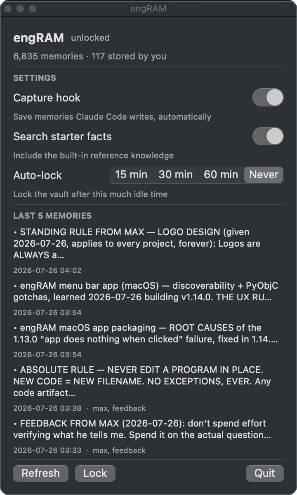
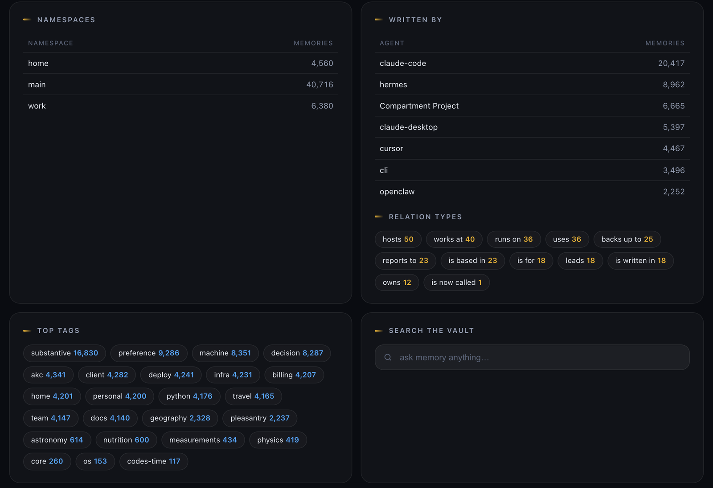
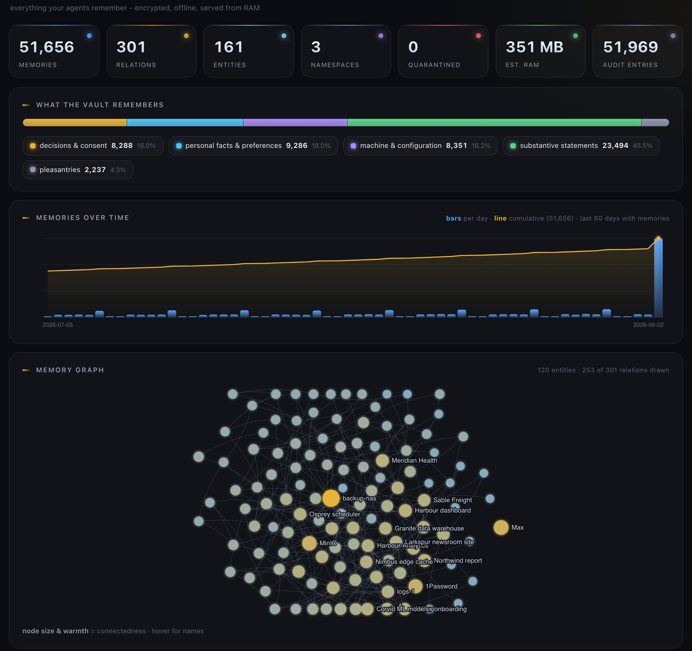

# Compartment

**Encrypted, fully offline memory for AI agents.** One vault on your own
computer, read and written by Claude Code, Claude Desktop, Hermes Agent,
OpenClaw, Cursor, Codex and any other MCP client. No API key, no account, no
network, no telemetry.

[](https://pypi.org/project/compartment/)
[](https://pepy.tech/project/compartment)
[](https://github.com/MaxFreedomPollard/Compartment/actions/workflows/ci.yml)
[](LICENSE)

[](https://registry.modelcontextprotocol.io/v0/servers?search=compartment)
[](https://cursor.directory/plugins/compartment)
[](https://glama.ai/mcp/servers/MaxFreedomPollard/Compartment)
[](https://mcpmarket.com/server/compartment)
[](https://mcpservers.org/servers/maxfreedompollard/compartment)
[](https://lobehub.com/mcp/maxfreedompollard-compartment)
[](https://mcptoplist.com/server/io.github.MaxFreedomPollard%2Fcompartment)

**One-click install** (after `pip install compartment && compartment init`):

<p>
<a href="https://cursor.com/install-mcp?name=compartment&config=eyJjb21tYW5kIjoiY29tcGFydG1lbnQiLCJhcmdzIjpbIi0tY2FsbGVyIiwiY3Vyc29yIiwic2VydmUiXX0="></a>
<a href="https://vscode.dev/redirect/mcp/install?name=compartment&config=%7B%22command%22%3A%22compartment%22%2C%22args%22%3A%5B%22--caller%22%2C%22vscode%22%2C%22serve%22%5D%7D"></a>
<a href="https://insiders.vscode.dev/redirect/mcp/install?name=compartment&config=%7B%22command%22%3A%22compartment%22%2C%22args%22%3A%5B%22--caller%22%2C%22vscode%22%2C%22serve%22%5D%7D&quality=insiders"></a>
<a href="https://maxfreedompollard.github.io/Compartment/add/lmstudio"></a>
<a href="https://maxfreedompollard.github.io/Compartment/add/goose"></a>
<a href="https://kiro.dev/launch/mcp/add?name=compartment&config=%7B%22command%22%3A%22compartment%22%2C%22args%22%3A%5B%22--caller%22%2C%22kiro%22%2C%22serve%22%5D%7D"></a>
</p>

Claude Code, Claude Desktop, Hermes Agent and OpenClaw are wired by one
command instead: `compartment integrate claude`, `hermes` or `openclaw`.

Compartment is persistent memory for AI agents, stored on your own computer.
What an agent learns in one session is available in every later session, in
every project, to every agent on the machine, and nothing leaves the machine.

Each memory is a single claim, recorded with its source and the date it was
learned. Memories can expire: set `expires` and the memory is removed after
that date. When a preference changes, the new one replaces the old one.
Recall is a hybrid vector and keyword search over an in-memory index. It
answers in about 12 ms and returns only what is relevant.

The embedding model is included in the package. Everything on disk is
encrypted, including the embedding vectors, and only your passphrase opens
it. A new vault comes with about 6,700 reference facts about hardware,
operating systems, ports, encodings and shell tools. They are ordinary
memories, and one switch removes them from search.

## How it compares with other memory servers

Where each server keeps memory and what protects it, as documented by each
project on 2 September 2026. Sources and the full table are in
[docs/COMPARISON.md](docs/COMPARISON.md); corrections are welcome as a PR
against that file.

| | Memory at rest | Encrypted | Account / API key | Network at runtime |
|---|---|---|---|---|
| **Compartment** | one encrypted file; index in RAM | **yes, vectors too** | none | none, CI-enforced |
| `@modelcontextprotocol/server-memory` | plaintext `memory.jsonl`, substring search | no | none | none |
| mem0 (open source) | vector store + LLM-extracted facts; its MCP server is hosted only | not documented | LLM key | LLM calls; telemetry on by default |
| Graphiti (Zep) / Letta | Neo4j / server + database | not documented | LLM key | LLM calls; telemetry on by default |
| claude-mem | local SQLite + Chroma | not documented | sign-in required | account + provider calls; telemetry on by default |
| basic-memory (AGPL) | Markdown + SQLite | not documented | none | telemetry on by default |
| Hindsight (Vectorize) | one container with embedded PostgreSQL | not documented | LLM key (local models configurable) | LLM calls; vendor states no telemetry |
| Supermemory | cloud service, or a self-hosted prebuilt binary | not documented | account (cloud) or LLM key (self-host) | cloud calls; self-host: vendor states no telemetry |
| Cognee | SQLite + LanceDB + Kuzu locally, or cloud | not documented | LLM key | LLM calls; telemetry on by default |
| MemOS | Neo4j + Qdrant self-hosted, or cloud | not documented | LLM key | LLM calls; telemetry on by default |

## The memory logic

**Almost everything is stored.** Only empty turns are dropped. A bare "OK" is
a decision, not noise: when the agent asks *"Want me to send this reply to
the client now?"* and the user answers *"OK"*, Compartment stores the
decision together with the question it answered. Small talk is kept but
ranked last.

**Importance is assigned by fixed tiers.** Decisions and consent 0.90,
personal facts and preferences 0.80, the user's machine and configuration
0.75, other substantive statements 0.55, small talk 0.20. Importance
multiplies a match score rather than adding to it, so it breaks near-ties in
favour of what matters and can never surface a memory that did not match the
question.

**One claim per memory, enforced.** The store rejects anything longer than
200 characters (the `max_memory_chars` setting), and anything containing
lists, headings or paragraphs, with an error that says how to split it.
Instructions alone did not work: on a real vault, the median memory written
by an agent was 1,938 characters of bulleted session log. `memory_store_many`
stores a batch in one call. `compartment atomize` splits over-limit memories
in an existing vault; each piece keeps the original's dates, and the original
is marked superseded but stays readable by id.

**Every memory records its source and date.** `source` is required: "from
chat", "read from pyproject.toml", "web search". `discovered` is the date the
fact was learned, separate from the date it was saved. Both are appended to
the text as a short clause, for example `[web search, 2026-08-01]`.

**Memories can expire.** For a fact that stops being true on a known date,
such as a sale price, a booking or a door code, set `expires` to that date
(`2026-09-03`) or to a duration (`14d`, `2w`, `3m`, `1y`). The memory is
removed after that date. `compartment expire` runs the sweep by hand;
`expire_memories` turns it off. Most facts should not expire; a wrong expiry
deletes a memory the user wanted.

**Facts accumulate; opinions update.** A new fact is added beside the
others: the door code changed, a script lives at a path, a release shipped.
An opinion replaces one. When a preference is stored with `kind="opinion"`,
the vault looks for a similar live opinion first. If it finds one, it returns
the old record instead of inserting, and the caller resends with
`supersedes=[old id]` to replace it, or `supersedes=[]` to keep both.
Restating a live opinion refreshes its date instead of storing a copy.
Superseded records are removed from search but kept in the audit chain and
readable by id, with a pointer to their replacement. `supersedes` also works
on facts, for corrections. Opinion ranking weights recency much more than
fact ranking, so the newest opinion wins. `compartment opinions audit` finds
overlapping live opinions in older vaults and keeps the newest, or reports
them for manual merging.

**Capture does not depend on the model.** A host that declares its own
memory in its system prompt can override any tool instruction. So
`integrate claude` installs a `PostToolUse` hook that writes each memory
file Claude Code saves into the vault, whether or not the model calls the
tool. The hook leaves your other hooks untouched, backs up `settings.json`
first, always exits successfully so it can never break your editor, and does
nothing while the vault is locked. `compartment hook status | install |
uninstall`, or `integrate claude --no-hooks`. `compartment import-claude`
imports anything the hook missed.

**Search returns what is relevant, not a fixed number.** Compartment returns
every memory whose score holds up against the best result for the same
question, up to a generous cap. The cut is relative because scores are not
comparable between questions: on a real vault, the nonsense query "how to
bake sourdough bread" scored higher than the real query "what did Max decide
about Airtable". A question the vault knows nothing about returns nothing.
Pass `top_k` to get exactly that many.

**Tags are kept current.** What a memory is about never changes; what it is
relevant to does. Suppose that while working on a project called Northwind
you learn that the client wants figures before conclusions. The agent tags
the memory `northwind`. Two years later the same client, now called Harbour,
hires you again, and the agent searches with the tag `harbour`. The memory
is still true, but a tag filter cannot find it. So a background pass gives
every memory the tags its nearest neighbours in embedding space carry,
weighted by similarity: as Harbour memories accumulate near that old one, it
picks up the `harbour` tag. Two more signals run alongside: tags that almost
always occur together imply each other, and an existing tag whose phrase
appears in a memory's text is attached. The pass writes only tags, never
text, dates or embeddings. It only adds tags unless you pass `--prune`,
`tags_origin` preserves the original tags, and `compartment retag --dry-run`
shows what would change.

**A graph as well as a list.** `memory_link` records a relation: subject,
predicate, object, optionally tied to a memory and to a validity window.
`memory_relations` answers by entity, by predicate, or as of a date.
Compartment stores and matches relations deterministically; the host model
decides what to link.

**Memories are data, not instructions.** Recalled memories are wrapped with
a notice that they are stored data. Content from an untrusted source can be
marked `quarantined`, which adds a warning to every recall of it. The host
agent must still treat memory as data.

**One embedding model per vault.** The model's SHA-256 is recorded in the
vault and checked on open, so similarity scores stay comparable. To change
model, run `compartment reindex --re-embed`.

**No LLM inside.** Embeddings run locally with a bundled 384-dimension int8
ONNX model in under 300 MB of RAM. The host model decides what to store and
forget; Compartment captures, encrypts and recalls. That split keeps the
offline guarantee absolute and every decision reproducible. With an offline
LLM, the whole agent runs with no network.

**See what it learned.** `compartment recent` lists the newest memories,
hiding the reference facts so your own memories are visible.
`compartment status` reports `organic_records` beside the total.
`memory_recent` is the same view over MCP.

## The app and the dashboard

<p align="center">
  
</p>

The same panel on each system: the **menu bar** on macOS, the
**notification area** on Windows, and an ordinary window on **Linux**, listed
in the applications menu. Linux gets a window on purpose: a tray icon may
never appear on GNOME or Wayland, and the control that unlocks your memories
must not fail silently.

The panel shows whether the vault is open, how many memories it holds and how
many you stored, the three settings worth changing (capture hook, whether
reference facts appear in search, auto-lock), which agents are connected with
buttons to connect Claude, Hermes Agent or OpenClaw, and the last five
memories. You can unlock, lock and change your passphrase there without a
terminal. The app keeps no vault in memory; it reads state from the CLI, so
it costs nothing when idle. It is meant to be one of the many apps on your
computer, not something you have to learn: every function is a button or a
switch, and the defaults were chosen by measurement.

The **Dashboard** button opens the whole vault in your browser: growth over
time, the relation graph with every entity named, tags, per-agent counts and
live search. It is served from RAM on 127.0.0.1 only, read-only, with no
outbound requests.

<p align="center">
  
</p>

<p align="center">
  
</p>

## The mathematics

Everything below is in one file,
[`src/compartment/ranking.py`](src/compartment/ranking.py), used by the
vault, the dashboard and the benchmark. A benchmark score therefore measures
the product itself.

### Storage: long memories are embedded in windows

The encoder reads 512 tokens. Text past that is not seen at all, so a long
memory used to be searchable only by its opening. On a real 6,705-memory
vault, 40% of records exceeded the window and **57.6% of the text was
invisible to semantic search**.

So each record is embedded as overlapping windows of `W = 448` tokens with a
stride of `S = 384`, giving 64 tokens of overlap so no fact is cut in half,
and the record is scored by its best window:

```
windows(d) = ceil( max(0, tokens(d) - W) / S ) + 1        capped at 64

s_vec(d)   = max over windows w of d :  cos(q, w)
```

Max, not average: a memory is relevant if any part of it is, and an average
would penalise a long memory for its other parts. With one window per record
this is identical to the old behaviour, so short memories are unaffected.
Most memories are short: 6,705 records produced 6,785 windows. Windows are
measured in model tokens, not characters, because a character budget is off
by a factor of three between prose and a hex digest.

### Recall: two channels, combined as evidence

Two indexes answer different questions. The vector index answers what a
memory means; the keyword index answers what it says. Their scores are not on
the same scale, and combining them is the whole problem.

Until 4.7, Compartment added them. Adding lets a merely-good semantic match
outvote conclusive literal evidence: searching a real vault for a commit SHA
that appears in exactly one memory returned that memory **below ten
paraphrases of it**, because the sum buried a first-place keyword hit.

The two channels are alternatives, not addends: either one alone can
establish relevance. That is a soft OR over independent evidence,

```
P(relevant) = 1 - (1 - p_vec)(1 - p_lex)
```

and the score is its logarithm, which ranks identically but keeps spreading
results near the top instead of saturating at 1:

```
score(d) = - w_vec · log(1 - p_vec(d))  -  w_lex · log(1 - p_lex(d))

w_vec = 0.75      w_lex = 0.25
```

Either channel near certainty carries the memory alone; neither can veto the
other.

**Turning a cosine into a probability.** An L2-normalized encoder gives
cosines that are comparable across queries, so fixed bounds map them.
Per-query min-max normalization would rescale the best hit of a hopeless
query up to 1.0 and throw that information away.

```
p_vec(d) = clamp( (cos(q, d) - 0.25) / (0.85 - 0.25),  0,  0.88 )
```

The 0.88 ceiling matters. A cosine is a similarity, never an identity: an
encoder can say *this is about the same thing*, never *this is the record you
named*. A literal match on a string unique to one memory can. So the semantic
channel is capped below what the literal channel can reach, and the cap is
forced by the weights: the literal channel tops out at
`0.25 · -log(1 - 0.999) = 1.727`, so `0.75 · -log(1 - cap) < 1.727`, giving
`cap < 0.90`.

**Turning a keyword hit into a probability, without BM25.** BM25 measures
how well a document matches, which does not settle a contest against a
semantic hit. What settles it is how unlikely the match was by chance. Each
query term carries its self-information over the vault, and a memory scores
the fraction of the query's information it accounts for:

```
I(t)     = log( N / (1 + df(t)) )                     N = records in the vault

p_lex(d) = ( Σ I(t) for query terms t present in d ) / ( Σ I(t) for all t )
```

A term unique to one memory is near-conclusive; a term in a tenth of the
vault is almost nothing, whatever its BM25. This is what makes literal and
semantic hits comparable.

The keyword index is queried as AND first, because an exact phrase is the
strongest signal. FTS5's implicit AND requires a nine-word question to appear
word for word, so when AND finds nothing it falls back to OR over the
informative terms only: anything in more than 10% of records is dropped. That
threshold is measured from the vault, not taken from an English stopword
list, so it works the same for code, names or other languages.

A small rank-agreement term is added, the one thing reciprocal-rank fusion
does well, sized to break ties:

```
+ w_rrf · k · [ 1/(k + rank_vec) + 1/(k + rank_lex) ]      w_rrf = 0.10, k = 20
```

### Importance and recency multiply the score

```
final(d) = score(d) · ( 1 + w_imp · (2·importance(d) - 1)
                          + w_rec · 2^( -age_days(d) / half_life ) )

facts:     w_imp = 0.15   w_rec = 0.10   half_life = 180 days, from `created`
opinions:  w_imp = 0.15   w_rec = 0.30   half_life = 30 days,  from the last
                                         re-affirmation (`affirmed`)
```

**Multiplicative, so a prior can only reorder memories that already
matched.** An additive prior would let an important memory surface for an
unrelated question. A memory that matched nothing scores zero and stays
there.

**Centred on the 0.5 default**, hence `2·importance - 1`. Every unweighted
memory carries 0.5, including the thousands of reference facts, so without
centring they would all get the same boost and importance would do nothing.
Centred, an unweighted memory is neutral and only a deliberate weight moves
it.

A fact's recency bonus halves every 180 days from when it was stored. An
opinion's halves every 30 days from when it was last re-affirmed, at three
times the weight, so the newest opinion on a subject wins.

### Retrieval order

Namespace, tag, date and reference-fact filters run after ranking, so a pool
sized to the requested number of results could be emptied by them while
matching memories sit just past the cut. The pool starts at 200 per channel
and widens up to three times when filtering leaves too few. Below 20,000
records the vector search is exact (SIMD matrix math, recall 1.0); above
that, HNSW at about 99% recall.

## Security and the lock model

The primitives: XChaCha20-Poly1305 encryption on everything at rest,
including embedding vectors, because vectors can be inverted back to text ·
Argon2id key slots, LUKS-style · a key per record, so `forget --shred`
destroys the key and the content is unrecoverable rather than marked deleted
· an fsync'd sealed journal, atomic compaction, and tested kill -9 recovery ·
a hash-chained audit log (`compartment audit verify`) · signed vault
manifests and packs · stdio transport with no open ports · a runtime guard
that aborts on any socket attempt (`--assert-offline`), with CI running the
whole suite under it on Linux, macOS and Windows. The full threat model,
including what Compartment cannot protect against, is in
[SECURITY.md](SECURITY.md).

### From the app

Everything you do day to day is a button. **Unlock** asks for your
passphrase; **Lock** closes the vault and clears every stored credential;
**Change password** rekeys it; **Auto-lock** chooses 15, 30 or 60 idle
minutes, or never. Compartment never generates a password, seed or recovery
phrase, and holds no credential you do not.

After an unlock the vault stays open across processes, logouts and logins
for as long as you leave it, until a restart or power loss, until the
auto-lock timer fires, or until you lock it. A restart or power loss always
locks it: the unlock credential is the master key wrapped with a random
per-boot secret that lives only in kernel memory and is never written to
disk, so a new boot cannot open it. A copy of the credential file on its own
is useless.

### From the command line

The same controls, plus two that only exist here:

- **`compartment unlock`** and **`compartment lock`** do what the buttons do.
  Agents can lock with the `memory_lock` tool. (Vaults from older versions
  that were issued a recovery phrase still accept it.)
- **`compartment 2fa enable`** adds a second factor: your passphrase plus a
  keyfile, for example on a USB stick. Both feed Argon2id together, so the
  requirement is enforced by the cryptography, not by a setting; a stolen
  vault file plus your passphrase opens nothing without the keyfile. The
  keyfile's location is remembered, so unlocking feels the same while it is
  present.
- **`compartment unlock --keychain`** on macOS is an explicit opt-in that
  survives reboots.

The `memory_unlock` MCP tool exists but is off by default, because enabling
it puts the passphrase in the model's context.

## One vault, many agents, any machine

### Without the command line

Every agent on the machine uses the same vault, and none of that needs
setting up: the app's **Connect an agent** buttons wire Claude, Hermes Agent
and OpenClaw, and what one agent stores the others recall. Claude, Hermes
Agent, Cursor and the CLI can use the vault at the same time: writes are
serialised by a file lock, every process notices writes by others and
reloads, and each agent has its own identity and namespace.

A locked vault is one file, `memory.vault` in the `.compartment` folder of
your home directory. To move to another machine, lock the vault, copy the
file there, install Compartment and unlock it in the app with your
passphrase.

### From the command line

The same move, signed so the recipient can check it, plus the escape
hatches:

```bash
compartment lock --sign
scp ~/.compartment/memory.vault other-machine:
compartment --vault memory.vault unlock     # your passphrase (+ keyfile if 2FA)
```

`lock --sign` adds an Ed25519 manifest that the recipient can check with
`compartment verify` and no credential. `export --plaintext` writes the vault
as JSONL and `import` reads it back, so you are never locked in.
[FORMAT.md](FORMAT.md) specifies the `.vault` and `.mpack` files byte by
byte. Per-agent namespaces take `rw`, `ro` or `none` grants in the settings
file, so a scratch agent can read without writing.

**Memory packs** are signed, read-only bundles of curated memories
(`compartment pack build | install | remove | list | export`). They install
under `packs/<name>`, read-only for every caller, and
`include_packs_in_search` toggles them. A pack's signature is checked against
a key you trust, never against the key inside the pack. The reference facts
are the one pack that lives in `main` as ordinary memories.
[PACKS.md](PACKS.md) covers authoring.

`compartment setup airgap-bundle` prepares an install for a machine with no
network; `setup download-model` and `setup download-longmemeval` fetch what
the optional benchmarks need.

## Measured, on an 8 GB baseline laptop

Every number below is reproducible on your machine with `compartment
selftest` and `compartment bench` (`--longmemeval` runs the retrieval
benchmark).

| Metric | Measured |
|---|---|
| Fresh install → open vault, offline | seconds, zero network |
| Vector search, 20k records (HNSW) | p95 0.68 ms |
| Full hybrid search (embed + windows + keywords + evidence fusion) | median 11.6 ms, p95 14.7 ms |
| Peak RSS, model + vault + index resident | 319 MB |
| Store one memory (embed + encrypt + fsync journal) | ~40 ms |
| Wheel size, model included | ~30 MB |
| Test suite (crypto, tamper, crash, offline, concurrency, 2FA, graph, dash, ranking) | 800+ tests, offline guard active |

## Install

**No command line needed.** On a Mac, download **Compartment.pkg** from the
[latest release](https://github.com/MaxFreedomPollard/Compartment/releases/latest)
and open it. Python, the embedding model and every dependency are inside it.
It asks you to choose a passphrase, creates the vault, and puts Compartment
in your menu bar, where the **Connect an agent** buttons do the rest.

From the command line, on any system:

| | |
|---|---|
| **pip** (macOS, Linux, Windows) | `pip install compartment && compartment init` |
| **pipx / uv** | `pipx install compartment` or `uv tool install compartment`, then `compartment init` |
| **Claude Code plugin** | after `pip install compartment && compartment init`: `/plugin marketplace add MaxFreedomPollard/Compartment`, then `/plugin install compartment@maxfreedompollard`. Codex reads the same marketplace file |
| **Docker** | `docker build -t compartment .` from a checkout; see [Wiring each agent](#wiring-each-agent) |

The pip route needs Python 3.11 or newer. The app runs on macOS 13 or
newer, on Windows with the Microsoft Visual C++ runtime installed, and on
any Linux desktop.

`init` asks you to choose a passphrase, creates the vault, loads the
reference facts, connects Claude Code, Hermes Agent or OpenClaw if they are
installed, and starts the app: a menu bar item on macOS, a tray icon on
Windows, a window on Linux. Restart your agent and it has a memory.

To connect an agent later, or any other client:

```bash
compartment integrate claude      # Claude Code + Claude Desktop
compartment integrate hermes      # Hermes Agent
compartment integrate openclaw    # OpenClaw
compartment integrate --list      # the 28 MCP clients it can wire: Cursor, VS Code, Cline, Roo Code, Zed, OpenCode, Codex CLI, Gemini CLI, Oh My Pi, LM Studio, AnythingLLM, BoltAI ...
compartment integrate --all       # every one of them that is installed here
```

`claude`, `hermes` and `openclaw` also get the **`/compartmentalize`** skill
installed in their skills directories. Any other MCP client uses this block
(stdio transport, no environment variables):

```json
{ "mcpServers": { "compartment": { "command": "compartment", "args": ["serve"] } } }
```

## Wiring each agent

None of this needs a terminal: the **Connect an agent** buttons in the app
run the same steps for Claude, Hermes Agent and OpenClaw. The commands below
are for people who prefer them, and for wiring a client the app does not
list. On Windows, run them in PowerShell with `py -m pip install compartment`
in place of `pip install compartment`.

**Claude (Code + Desktop)**

```bash
pip install compartment && compartment init && compartment integrate claude
```

Registers the MCP server with the Claude Code CLI (user scope, all
projects), imports the memories Claude Code has already written to its
memory files (copy-only and repeatable; `--no-import` skips it), installs the
capture hook (`--no-hooks` skips it), installs the `/compartmentalize` skill,
writes a managed block into `CLAUDE.md`, and prints the Claude Desktop config
block. The server also describes itself in the MCP handshake, telling the
model to recall before answering and to store durable facts, credentials,
names and decisions, so Claude uses Compartment as its memory without any
manual instruction.

**Hermes Agent**

```bash
pip install compartment && compartment init && compartment integrate hermes
```

Installs the provider plugin into the Hermes environment and runs
`hermes memory setup compartment`; verify with `hermes memory status`.
Hermes Agent 0.20.0 and newer also read the portable
[Agent Plugins](https://agent-plugins.org) format, and this repository is
one. That route installs the MCP server and the `/compartmentalize` skill
from GitHub:

```bash
pip install compartment && compartment init
hermes plugins install MaxFreedomPollard/Compartment
hermes plugins enable compartment
```

The provider is the fuller integration, because it recalls and stores on
every turn; the portable package works only when the model calls its tools.
On macOS and Windows both install to the same plugin directory name, so use
one or the other.

**OpenClaw**

```bash
pip install compartment && compartment init && compartment integrate openclaw
```

Writes the `mcpServers` entry into `~/.openclaw/openclaw.json`, with a
backup. Then run `openclaw gateway restart` and check with
`openclaw mcp list`.

**Any MCP client**

`compartment integrate <client>` wires any of the 28 clients in `--list`.
Each config write takes a byte-exact backup first, merges rather than
replaces, writes atomically, and refuses to touch a file it cannot parse (it
prints the block to paste instead). To do it by hand, use the block in
[Install](#install); VS Code uses the key `servers` with `"type": "stdio"`,
Zed uses `context_servers`, Codex uses TOML under
`[mcp_servers.compartment]`. `--vault` and `--caller` are optional; the
defaults are `~/.compartment/memory.vault` and caller `user`.
Client-by-client walkthroughs are in
[docs/INTEGRATIONS.md](docs/INTEGRATIONS.md).

**Docker**

`docker build -t compartment .` from a checkout builds a headless image:
stdio only, no port, unprivileged user, vault on a bind mount at `/data`.
Create the vault on the host first with `compartment init`, because that
step prompts for the passphrase.

## Configuration

Nothing here is required. Compartment installs configured; this is the whole
surface if you want to change something.

### In the app

The panel behind the icon: **Unlock** and **Lock**, **Change password**,
**Create memories automatically** (the capture hook), **Search starter
facts**, **Auto-lock** (15, 30, 60 minutes or never), the **CONNECT AN
AGENT** buttons for Claude, Hermes Agent and OpenClaw, **Refresh** and
**Quit**.

### Commands

Global flags, before the command: `--vault PATH`, `--caller NAME`,
`--keyfile PATH`, `--assert-offline`, `--version`.

| Command | What it does |
|---|---|
| `init` | create the vault. `--passphrase`, `--creator`, `--keychain`, `--no-session`, `--no-app` |
| `unlock` / `lock` | open or close it. `--passphrase-stdin`, `--keyfile`, `--keychain`, `--once`; `lock --sign --identity` |
| `status` / `verify` / `selftest` | what is in it, is it intact, does it work |
| `store` / `get` / `forget` | one memory. `--source` (required), `--discovered`, `--expires`, `--namespace`, `--tag`, `--importance`, `--kind fact\|opinion`, `--supersedes ID`, `--keep-both`, `--quarantined`, `--raw`; `forget --shred` |
| `search` / `recent` | find things. `--namespace`, `--tag`, `--top-k`, `--limit`, `--all`, `--json` |
| `expire` | remove expired memories |
| `atomize` | list over-limit blob memories as JSONL (`--out` + `--plaintext`), apply an agent-written split plan (`--apply`) |
| `opinions audit` | backfill `kind` on opinion-shaped records, cluster overlapping live opinions, resolve with `--keep-newest`. `--threshold`, `--no-backfill`, `--json` |
| `link` / `relations` / `unlink` | the relation graph, with validity windows (`--from`, `--to`, `--as-of`) |
| `panel` (`menubar`, `tray`) | the app. `--show`, `--self-check`, `--render`, `--login` |
| `integrate <agent>` | wire claude, hermes, openclaw or any listed client, and install `/compartmentalize`. `--list`, `--all`, `--no-import`, `--no-hooks` |
| `hook` | the Claude Code capture hook: `install --pin-vault`, `uninstall`, `status`, `capture` |
| `import-claude` | pull in what Claude Code already wrote. `--dir`, `--namespace`, `--dry-run` |
| `serve` | the MCP server, over stdio |
| `dash` | read the vault in a browser: 127.0.0.1, one-time token, GET only |
| `export` / `import` | `export --plaintext` writes it unencrypted; `import` reads it back |
| `rekey` | change the passphrase. `--new-passphrase-stdin` |
| `2fa` | `enable`, `disable`, `status`: a keyfile as a second factor |
| `audit` | `verify`, `repair` the hash-chained history |
| `retag` | recompute tags from the current vault (`--dry-run`, `--prune`); never changes memory text |
| `reindex` | rebuild the index, and give long records the embedding windows they are missing. `--int8`, `--f32`, `--re-embed`, `--model` |
| `pack` | `build`, `install`, `remove`, `list`, `export` signed memory packs (`--trusted-key`) |
| `bench` | `--records`, `--longmemeval`, `--variant`, `--limit` |
| `setup` | `download-model`, `download-longmemeval`, `airgap-bundle` |
| `update` | upgrade in place. `--source` takes GitHub main, `--no-app` skips the restart |
| `uninstall` | remove it. The vault is kept unless you pass `--purge` |

`compartment panel --login on | off | status` controls starting at login (on
Linux, the applications menu entry). `init --no-app` skips the app on
headless machines and in CI.

`compartment dash` is the Dashboard button from the terminal: the whole vault
in your browser, growth over time, the relation graph with every entity
named, tags, per-agent counts, live search. It serves from RAM on 127.0.0.1
only, behind a random URL token, read-only, with no outbound requests and no
configuration. Ctrl-C closes it.

### The /compartmentalize skill

`compartment integrate <agent>` writes one file into that agent's own skills
directory, and `compartment uninstall` takes it back:

| Agent | Path |
|---|---|
| Claude Code | `~/.claude/skills/compartmentalize/SKILL.md` |
| Hermes Agent | `$HERMES_HOME` or `~/.hermes/skills/compartmentalize/SKILL.md` |
| OpenClaw | `$OPENCLAW_HOME` or `~/.openclaw/skills/compartmentalize/SKILL.md` |

All three use the same Agent Skills layout, so it is one file. Only the user
runs it. Type it before compacting, or at any time, and the agent stores the
whole conversation in the vault: people and contacts, credentials and where
they live, URLs and hosts, decisions and the reasons for them, and a record
of the session itself. It makes many `memory_store` calls. You can edit your
copy; a later install backs up a changed copy rather than overwriting it.

### Settings file

`<vault>.config.json`, beside the vault, holding grants per caller and:

| Setting | Default | Meaning |
|---|---|---|
| `auto_lock_minutes` | `30` | idle time before it locks. `0` never locks |
| `search_starter_facts` | `true` | whether the seeded facts join search results |
| `include_packs_in_search` | `true` | the same, for installed packs |
| `expire_memories` | `true` | remove expired memories automatically |
| `duplicate_threshold` | `0.97` | cosine similarity at which a store is a duplicate |
| `max_memory_chars` | `200` | the one-claim length limit for authored memories. `0` disables the length and layout checks |
| `opinion_update_threshold` | `0.80` | similarity at which a new opinion is an update of a live one and needs a supersedes decision |
| `opinion_reaffirm_threshold` | `0.97` | similarity at which a restated opinion re-affirms the live record instead of storing |
| `retag_interval_hours` | `6` | how often the background pass recomputes tags. `0` turns it off |
| `retag_prune` | `false` | whether that pass may also remove tags |
| `index_precision` | `"f32"` | `"int8"` uses a quarter of the RAM |
| `unlock_tool_enabled` | `false` | lets an agent unlock the vault. Off because the passphrase would cross the model's context |

### Environment

`COMPARTMENT_VAULT` which vault to use, `COMPARTMENT_PASSPHRASE` for scripts
and CI, `COMPARTMENT_SESSION_DIR` where the unlock credential lives,
`COMPARTMENT_UI_SCALE` panel scale, `COMPARTMENT_ASSERT_OFFLINE` abort on any
network attempt. `HERMES_HOME`, `OPENCLAW_HOME` and `XDG_DATA_HOME` are read
where they apply. Anything exported as `ENGRAM_*` still works.

### MCP tools

Every tool has a title and a read-only or destructive annotation, so a
client can tell the seven read-only tools from the ones that write before
calling anything. `memory_search`, `memory_store`, `memory_store_many`,
`memory_get`, `memory_recent`, `memory_forget`, `memory_link`,
`memory_relations`, `memory_unlink`, `memory_list_namespaces`,
`memory_status`, `memory_lock`, `memory_selftest`. `memory_unlock` exists but
is off unless you turn it on above.

## Documentation

| | |
|---|---|
| [docs/MEMORY.md](docs/MEMORY.md) | how memory is stored, what gets remembered, and the ranking design |
| [docs/INTEGRATIONS.md](docs/INTEGRATIONS.md) | selecting Compartment in Hermes Agent, OpenClaw, Claude, everything else |
| [docs/COMPARISON.md](docs/COMPARISON.md) | other memory servers, with sources |
| [SECURITY.md](SECURITY.md) | the full threat model and its limits |
| [FORMAT.md](FORMAT.md) | byte-level `.vault` and `.mpack` specs (language-agnostic) |
| [PACKS.md](PACKS.md) | authoring and shipping signed memory packs |
| [CONTRIBUTING.md](CONTRIBUTING.md) | setup, good issues, and the guarantees to keep |
| [RELEASING.md](RELEASING.md) | how a release is cut |

## Privacy Policy

Compartment collects no data: no telemetry, no analytics, no account, and no
network at runtime. Memories are stored only on your machine, AEAD-encrypted
at rest with a passphrase that never leaves it, and nothing is shared with
anyone. The full policy, covering collection, storage, network access,
third-party sharing, retention, and contact, is at
<https://maxfreedompollard.github.io/Compartment/privacy>.

## Where to find it

Compartment is listed on [PyPI](https://pypi.org/project/compartment/), the
[official MCP registry](https://registry.modelcontextprotocol.io/v0/servers?search=compartment),
the [Cursor Directory](https://cursor.directory/plugins/compartment),
[Glama](https://glama.ai/mcp/servers/MaxFreedomPollard/Compartment),
[LobeHub](https://lobehub.com/mcp/maxfreedompollard-compartment),
[MCP Toplist](https://mcptoplist.com/server/io.github.MaxFreedomPollard%2Fcompartment),
[MCP Market](https://mcpmarket.com/server/compartment),
[mcpservers.org](https://mcpservers.org/servers/maxfreedompollard/compartment),
[TensorBlock](https://www.tensorblock.co/mcp/servers/github-maxfreedompollard-compartment-4ab11161),
the [toolsdk.ai registry](https://github.com/toolsdk-ai/toolsdk-mcp-registry/blob/main/packages/knowledge-memory/compartment.json),
[Libraries.io](https://libraries.io/pypi/compartment),
[Snyk Advisor](https://snyk.io/advisor/python/compartment) and
[deps.dev](https://deps.dev/pypi/compartment), and in the curated lists
[abordage/awesome-mcp](https://github.com/abordage/awesome-mcp),
[TensorBlock/awesome-mcp-servers](https://github.com/TensorBlock/awesome-mcp-servers/blob/main/docs/knowledge-management--memory.md)
and [Jenqyang/Awesome-AI-Agents](https://github.com/Jenqyang/Awesome-AI-Agents).

[](https://mcptoplist.com/server/io.github.MaxFreedomPollard%2Fcompartment)
[](https://lobehub.com/mcp/maxfreedompollard-compartment)

<a href="https://glama.ai/mcp/servers/MaxFreedomPollard/Compartment"></a>

Bugs and feature requests: [Issues](https://github.com/MaxFreedomPollard/Compartment/issues).
Support and questions: [Discussions](https://github.com/MaxFreedomPollard/Compartment/discussions);
security reports: [SECURITY.md](SECURITY.md).
Questions and ideas: [Discussions](https://github.com/MaxFreedomPollard/Compartment/discussions).

---

mcp-name: io.github.MaxFreedomPollard/compartment
